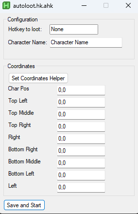

# Tibia auto loot macro

This is a macro for autoloot on Tibia. Nothing too special around it. It is based on autohotkey.

## Requirements

[Autohotkey v2.0](https://www.autohotkey.com/)

## How to use

- Download the binary or the .ahk file.
- Double click you should see the following screen:



- First set a hotkey to loot
- Add your character name, this is used to find the tibia window and bring it up when using the button (Set Coordinates Helper).
- Click on Set Coordinates Helper. It will show you a tooltip in your mouse with the current position and it will automatically minimize the program and bring tibia up. Put your mouse in the correspondent SQM and press _RIGHT CLICK_ it will copy the coordinates and it will bring the program back up. Paste it in the correct spot in the list and keep doing it until you have all.
- Click on Save and Start.

## Documentation

- This hotkey saves the previous mouse location so when it's done looting the mouse will automatically go back to it previous position.

- This will save a config .ini file in the following location:

```
C:\Users\<YOUR USERNAME>\autoloot.ini
```

If you want to reset the configuration you can just delete it.

- If the configuration file already exists, it will load it and it will start the hotkey automatically, so you can just set it up once and it should work without any change.

- The character name is only used during the setup, if you are using another character later it will work anyways, I don't check the name afterwards.
